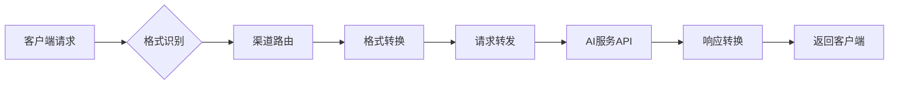

# 多渠道AI API统一转换代理系统 | Multi-Channel AI API Unified Conversion Proxy System

<div align="right">
  <details>
    <summary>🌐 Language / 语言</summary>
    <p>
      <a href="README.md">🇨🇳 中文版本</a><br>
      <a href="README_EN.md">🇺🇸 English Version</a>
    </p>
  </details>
</div>

## 📖 项目概述

这是一个多渠道AI API统一转换代理系统，支持OpenAI、Anthropic Claude、Google Gemini三种API格式的相互转换，具备多渠道管理和全面能力检测功能。


🔄 系统工作原理

### 核心转换流程


#### 🎯 1. 格式识别
- **自动检测**：根据请求路径和参数自动识别源API格式
- **支持格式**：OpenAI `/v1/chat/completions` | Anthropic `/v1/messages` | Gemini `/v1/models`
- **智能解析**：解析请求头、参数结构，确定源格式规范

#### 🚀 2. 渠道路由  
- **Key映射**：根据自定义API Key查找目标渠道配置
- **负载均衡**：支持多渠道轮询和权重分配
- **故障转移**：自动切换到备用渠道，确保服务可用性

#### ⚡ 3. 格式转换
- **请求转换**：将源格式的请求体转换为目标API格式
- **参数映射**：自动处理模型名称、参数结构的差异
- **兼容处理**：保持所有高级功能的完整性

#### 🌐 4. 请求转发
- **HTTP代理**：透明转发到真实的AI服务API
- **认证处理**：自动注入目标渠道的API Key和认证信息
- **超时控制**：可配置的请求超时和重试机制

#### 🔄 5. 响应转换
- **格式统一**：将目标API响应转换回源格式
- **流式支持**：完整支持SSE流式响应的格式转换
- **错误映射**：统一错误码和错误信息格式

## 🎯 核心功能

### 1. 智能格式转换
```bash
# 支持的转换路径
OpenAI ↔ Anthropic ↔ Gemini
  ↑         ↑         ↑
  └─────────┼─────────┘
            │
        任意互转
```

**支持的高级功能转换：**
- ✅ **流式响应**：SSE格式的完整转换
- ✅ **函数调用**：Tool Calling跨平台映射
- ✅ **视觉理解**：图像输入格式统一处理
- ✅ **结构化输出**：JSON Schema自动适配
- ✅ **模型映射**：智能模型名称转换
- ✅ **思考预算转换**：支持OpenAI reasoning_effort ↔ Anthropic/Gemini thinkingBudget互转

### 2. 全面能力检测
- **基础能力**：聊天对话、流式输出、系统消息、多轮对话
- **高级能力**：视觉理解、文件上传、结构化输出、JSON模式
- **工具能力**：函数调用、工具使用、代码执行
- **模型检测**：自动获取支持的模型列表
- **多平台支持**：OpenAI、Anthropic Claude、Google Gemini

### 3. 多格式模型列表API 📋
支持返回三种不同格式的模型列表：

- **OpenAI格式**：`GET /v1/models` (Bearer认证)
- **Anthropic格式**：`GET /v1/models` (x-api-key认证)  
- **Gemini格式**：`GET /v1beta/models` (key参数认证)

从真实API获取模型数据，自动格式转换，告别硬编码模型列表。

## 🚀 快速开始

1. **安装依赖**
```bash
pip install -r requirements.txt
```

2. **启动Web服务**
```bash
python web_server.py
```

3. **访问Web界面**
- 打开浏览器访问：http://localhost:3000
- 选择AI提供商，输入API配置
- 一键检测所有能力，查看详细结果
- 使用转换功能，详见系统工作原理

## 🔧 .env配置

复制 `.env.example` 为 `.env` 并根据需要修改配置：

### 管理员认证配置
- `ADMIN_PASSWORD` - 管理员登录密码（默认：admin123），用于Web管理界面

### 数据加密配置（可选）
- `ENCRYPTION_KEY` - API密钥加密密钥，32字节的Fernet加密密钥
- `SESSION_SECRET_KEY` - 会话加密密钥，64字符的十六进制字符串

### Web服务器配置（可选）
- `WEB_PORT` - Web服务器端口（默认：3000）

### AI服务商配置（建议）
- `ANTHROPIC_MAX_TOKENS` - Claude模型最大token数限制（默认：32000）
- `OPENAI_REASONING_MAX_TOKENS` - OpenAI思考模型max_completion_tokens默认值（默认：32000）

### 思考预算映射配置（建议，若不设置，在设置思考预算时可能会出错）
- `OPENAI_LOW_TO_ANTHROPIC_TOKENS` - OpenAI low等级对应的Anthropic token数（默认：2048）
- `OPENAI_MEDIUM_TO_ANTHROPIC_TOKENS` - OpenAI medium等级对应的Anthropic token数（默认：8192）
- `OPENAI_HIGH_TO_ANTHROPIC_TOKENS` - OpenAI high等级对应的Anthropic token数（默认：16384）
- `OPENAI_LOW_TO_GEMINI_TOKENS` - OpenAI low等级对应的Gemini token数（默认：2048）
- `OPENAI_MEDIUM_TO_GEMINI_TOKENS` - OpenAI medium等级对应的Gemini token数（默认：8192）
- `OPENAI_HIGH_TO_GEMINI_TOKENS` - OpenAI high等级对应的Gemini token数（默认：16384）
- `ANTHROPIC_TO_OPENAI_LOW_REASONING_THRESHOLD` - Anthropic token数判断为low的阈值（默认：2048）
- `ANTHROPIC_TO_OPENAI_HIGH_REASONING_THRESHOLD` - Anthropic token数判断为high的阈值（默认：16384）
- `GEMINI_TO_OPENAI_LOW_REASONING_THRESHOLD` - Gemini token数判断为low的阈值（默认：2048）
- `GEMINI_TO_OPENAI_HIGH_REASONING_THRESHOLD` - Gemini token数判断为high的阈值（默认：16384）

### 数据库配置（可选）
- `DATABASE_TYPE` - 数据库类型（sqlite 或 mysql，默认：sqlite）
- `DATABASE_PATH` - SQLite数据库文件路径（默认：data/channels.db）

#### MySQL数据库配置（当DATABASE_TYPE=mysql时使用）
- `MYSQL_HOST` - MySQL服务器地址
- `MYSQL_PORT` - MySQL端口号（默认：3306）
- `MYSQL_USER` - MySQL用户名
- `MYSQL_PASSWORD` - MySQL密码
- `MYSQL_DATABASE` - MySQL数据库名
- `MYSQL_SOCKET` - MySQL socket文件路径（可选，本地连接时使用）

### 日志配置（可选）
- `LOG_LEVEL` - 日志级别（DEBUG/INFO/WARNING/ERROR/CRITICAL，默认：WARNING）
- `LOG_FILE` - 日志文件路径（默认：logs/app.log）
- `LOG_MAX_DAYS` - 日志文件保留天数（默认：1天）

## 🔧 客户端集成指南

### Claude Code 中使用

#### Mac
```bash
export ANTHROPIC_BASE_URL="https://your_url.com"
# 测试发现claude code密钥需要以sk-开头
export ANTHROPIC_API_KEY="sk-xxx"
claude --model your_model
```

#### Windows CMD
```cmd
set ANTHROPIC_BASE_URL=https://your_url.com
# 测试发现claude code密钥需要以sk-开头
set ANTHROPIC_API_KEY=sk-xxx
claude --model your_model
```

### Gemini-CLI 中使用

#### Mac
```bash
export GOOGLE_GEMINI_BASE_URL="https://your_url.com"
export GEMINI_API_KEY="your_api_key"
gemini -m your_model
```

#### Windows CMD
```cmd
set GOOGLE_GEMINI_BASE_URL=https://your_url.com
set GEMINI_API_KEY=your_api_key
gemini -m your_model
```

### Cherry Studio 中使用
> 选择你想转换的供应商格式，填入url，填入你想使用的渠道的key

## 🚢 部署指南

### Docker 部署

```bash
# 构建镜像
docker build -t ai-api-detector .

# 运行容器  
docker run -p 8000:8000 ai-api-detector
```

### 本地开发

```bash
# 克隆项目
git clone <repository-url>
cd Api-Conversion

# 安装依赖
pip install -r requirements.txt

# 启动开发服务器
python web_server.py --debug
```

### Render 平台部署

项目已配置好 `render.yaml`，支持一键部署：

1. **将代码推送到GitHub**
2. **连接Render平台**：https://dashboard.render.com
3. **自动部署**：Render会自动读取配置并部署

**配置详情：**

- **构建命令**：`pip install -r requirements.txt`
- **启动命令**：`python web_server.py --host 0.0.0.0 --port $PORT`
- **环境变量**：`PYTHONPATH=/opt/render/project/src`

## 📊 支持的能力检测

| 能力 | 描述 | OpenAI | Anthropic | Gemini |
|------|------|--------|-----------|--------|
| 基础聊天 | 基本对话功能 | ✅ | ✅ | ✅ |
| 流式输出 | 实时流式响应 | ✅ | ✅ | ✅ |
| 系统消息 | 系统指令支持 | ✅ | ✅ | ✅ |
| 函数调用 | 工具使用能力 | ✅ | ✅ | ✅ |
| 结构化输出 | JSON格式输出 | ✅ | ✅ | ✅ |
| 视觉理解 | 图像分析能力 | ✅ | ✅ | ✅ |
| 思考预算 | 智能思考功能 | ✅ | ✅ | ✅ |


## 📄 许可证

MIT License