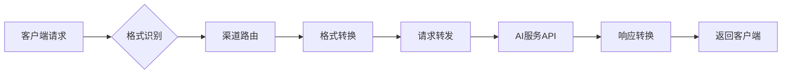
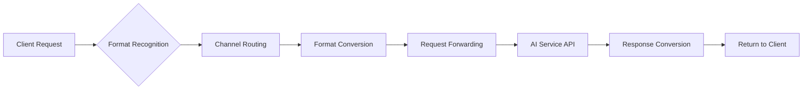

# 多渠道AI API统一转换代理系统

<div align="right">
  <a href="#english-version">🇺🇸 English</a> | 
  <a href="#chinese-version">🇨🇳 中文</a>
</div>

## <a name="chinese-version"></a>中文版


## 📖 项目概述

这是一个多渠道AI API统一转换代理系统，支持OpenAI、Anthropic Claude、Google Gemini三种API格式的相互转换，具备多渠道管理和全面能力检测功能。


🔄 系统工作原理

### 核心转换流程


#### 🎯 1. 格式识别
- **自动检测**：根据请求路径和参数自动识别源API格式
- **支持格式**：OpenAI `/v1/chat/completions` | Anthropic `/v1/messages` | Gemini `/v1/models`
- **智能解析**：解析请求头、参数结构，确定源格式规范

#### 🚀 2. 渠道路由  
- **Key映射**：根据自定义API Key查找目标渠道配置
- **负载均衡**：支持多渠道轮询和权重分配
- **故障转移**：自动切换到备用渠道，确保服务可用性

#### ⚡ 3. 格式转换
- **请求转换**：将源格式的请求体转换为目标API格式
- **参数映射**：自动处理模型名称、参数结构的差异
- **兼容处理**：保持所有高级功能的完整性

#### 🌐 4. 请求转发
- **HTTP代理**：透明转发到真实的AI服务API
- **认证处理**：自动注入目标渠道的API Key和认证信息
- **超时控制**：可配置的请求超时和重试机制

#### 🔄 5. 响应转换
- **格式统一**：将目标API响应转换回源格式
- **流式支持**：完整支持SSE流式响应的格式转换
- **错误映射**：统一错误码和错误信息格式

## 🎯 核心功能

### 1. 全面能力检测
- **基础能力**：聊天对话、流式输出、系统消息、多轮对话
- **高级能力**：视觉理解、文件上传、结构化输出、JSON模式
- **工具能力**：函数调用、工具使用、代码执行
- **模型检测**：自动获取支持的模型列表
- **多平台支持**：OpenAI、Anthropic Claude、Google Gemini

### 2. 智能格式转换
```bash
# 支持的转换路径
OpenAI ↔ Anthropic ↔ Gemini
  ↑         ↑         ↑
  └─────────┼─────────┘
            │
        任意互转
```

**支持的高级功能转换：**
- ✅ **流式响应**：SSE格式的完整转换
- ✅ **函数调用**：Tool Calling跨平台映射
- ✅ **视觉理解**：图像输入格式统一处理
- ✅ **结构化输出**：JSON Schema自动适配
- ✅ **模型映射**：智能模型名称转换

### 3. 多渠道管理（规划中）
- **渠道类型**：官方API、代理服务、自建服务
- **智能路由**：基于延迟、成功率的智能选择
- **健康检查**：实时监控渠道可用性
- **配额管理**：支持多渠道的配额分配

## 🚀 快速开始

1. **安装依赖**
```bash
pip install -r requirements.txt
```

2. **启动Web服务**
```bash
python web_server.py
```

3. **访问Web界面**
- 打开浏览器访问：http://localhost:3000
- 选择AI提供商，输入API配置
- 一键检测所有能力，查看详细结果
- 使用转换功能，详见系统工作原理

## 🔧 客户端集成指南

### Claude Code 中使用

#### Mac
```bash
export ANTHROPIC_BASE_URL="https://your_url.com"
# 测试发现claude code密钥需要以sk-开头
export ANTHROPIC_API_KEY="sk-xxx"
claude --model your_model
```

#### Windows CMD
```cmd
set ANTHROPIC_BASE_URL=https://your_url.com
# 测试发现claude code密钥需要以sk-开头
set ANTHROPIC_API_KEY=sk-xxx
claude --model your_model
```

### Gemini-CLI 中使用

#### Mac
```bash
export GOOGLE_GEMINI_BASE_URL="https://your_url.com"
export GEMINI_API_KEY="your_api_key"
gemini -m your_model
```

#### Windows CMD
```cmd
set GOOGLE_GEMINI_BASE_URL=https://your_url.com
set GEMINI_API_KEY=your_api_key
gemini -m your_model
```

### Cherry Studio 中使用
> 选择你想转换的供应商格式，填入url，填入你想使用的渠道的key

## 🚢 部署指南

### Render 平台部署（推荐）

项目已配置好 `render.yaml`，支持一键部署：

1. **将代码推送到GitHub**
2. **连接Render平台**：https://dashboard.render.com
3. **自动部署**：Render会自动读取配置并部署

**配置详情：**
- **构建命令**：`pip install -r requirements.txt`
- **启动命令**：`python web_server.py --host 0.0.0.0 --port $PORT`
- **环境变量**：`PYTHONPATH=/opt/render/project/src`

### Docker 部署

```bash
# 构建镜像
docker build -t ai-api-detector .

# 运行容器  
docker run -p 8000:8000 ai-api-detector
```

### 本地开发

```bash
# 克隆项目
git clone <repository-url>
cd Api-Conversion

# 安装依赖
pip install -r requirements.txt

# 启动开发服务器
python web_server.py --debug
```

## 📊 支持的能力检测

| 能力 | 描述 | OpenAI | Anthropic | Gemini |
|------|------|--------|-----------|--------|
| 基础聊天 | 基本对话功能 | ✅ | ✅ | ✅ |
| 流式输出 | 实时流式响应 | ✅ | ✅ | ✅ |
| 系统消息 | 系统指令支持 | ✅ | ✅ | ✅ |
| 函数调用 | 工具使用能力 | ✅ | ✅ | ✅ |
| 结构化输出 | JSON格式输出 | ✅ | ✅ | ✅ |
| 视觉理解 | 图像分析能力 | ✅ | ✅ | ✅ |

---

## 📄 许可证

MIT License

---

## <a name="english-version"></a>English Version

<div align="right">
  <a href="#english-version">🇺🇸 English</a> | 
  <a href="#chinese-version">🇨🇳 中文</a>
</div>

# Multi-Channel AI API Unified Conversion Proxy System

## 📖 Project Overview

This is a multi-channel AI API unified conversion proxy system that supports mutual conversion between OpenAI, Anthropic Claude, and Google Gemini API formats, with multi-channel management and comprehensive capability detection features.


🔄 System Working Principle

### Core Conversion Flow


#### 🎯 1. Format Recognition
- **Auto Detection**: Automatically identify source API format based on request path and parameters
- **Supported Formats**: OpenAI `/v1/chat/completions` | Anthropic `/v1/messages` | Gemini `/v1/models`
- **Smart Parsing**: Parse request headers and parameter structure to determine source format specification

#### 🚀 2. Channel Routing
- **Key Mapping**: Find target channel configuration based on custom API Key
- **Load Balancing**: Support multi-channel polling and weight allocation
- **Failover**: Automatically switch to backup channels to ensure service availability

#### ⚡ 3. Format Conversion
- **Request Conversion**: Convert source format request body to target API format
- **Parameter Mapping**: Automatically handle differences in model names and parameter structures
- **Compatibility Handling**: Maintain integrity of all advanced features

#### 🌐 4. Request Forwarding
- **HTTP Proxy**: Transparently forward to real AI service APIs
- **Authentication Handling**: Automatically inject target channel's API Key and authentication info
- **Timeout Control**: Configurable request timeout and retry mechanisms

#### 🔄 5. Response Conversion
- **Format Unification**: Convert target API response back to source format
- **Streaming Support**: Full support for SSE streaming response format conversion
- **Error Mapping**: Unified error codes and error message formats

## 🎯 Core Features

### 1. Comprehensive Capability Detection
- **Basic Capabilities**: Chat conversation, streaming output, system messages, multi-turn dialogue
- **Advanced Capabilities**: Vision understanding, file upload, structured output, JSON mode
- **Tool Capabilities**: Function calling, tool usage, code execution
- **Model Detection**: Automatically retrieve supported model lists
- **Multi-Platform Support**: OpenAI, Anthropic Claude, Google Gemini

### 2. Smart Format Conversion
```bash
# Supported conversion paths
OpenAI ↔ Anthropic ↔ Gemini
  ↑         ↑         ↑
  └─────────┼─────────┘
            │
     Any mutual conversion
```

**Supported advanced feature conversions:**
- ✅ **Streaming Response**: Complete conversion of SSE format
- ✅ **Function Calling**: Tool Calling cross-platform mapping
- ✅ **Vision Understanding**: Unified processing of image input formats
- ✅ **Structured Output**: Automatic JSON Schema adaptation
- ✅ **Model Mapping**: Smart model name conversion

### 3. Multi-Channel Management (Planned)
- **Channel Types**: Official API, proxy services, self-hosted services
- **Smart Routing**: Intelligent selection based on latency and success rate
- **Health Checks**: Real-time monitoring of channel availability
- **Quota Management**: Support quota allocation across multiple channels

## 🚀 Quick Start

1. **Install Dependencies**
```bash
pip install -r requirements.txt
```

2. **Start Web Service**
```bash
python web_server.py
```

3. **Access Web Interface**
- Open browser and visit: http://localhost:3000
- Select AI provider, input API configuration
- One-click detection of all capabilities, view detailed results
- Use conversion functionality, see system working principle for details

## 🔧 Client Integration Guide

### Using with Claude Code

#### Mac
```bash
export ANTHROPIC_BASE_URL="https://your_url.com"
# Testing found that claude code requires keys to start with sk-
export ANTHROPIC_API_KEY="sk-xxx"
claude --model your_model
```

#### Windows CMD
```cmd
set ANTHROPIC_BASE_URL=https://your_url.com
# Testing found that claude code requires keys to start with sk-
set ANTHROPIC_API_KEY=sk-xxx
claude --model your_model
```

### Using with Gemini-CLI

#### Mac
```bash
export GOOGLE_GEMINI_BASE_URL="https://your_url.com"
export GEMINI_API_KEY="your_api_key"
gemini -m your_model
```

#### Windows CMD
```cmd
set GOOGLE_GEMINI_BASE_URL=https://your_url.com
set GEMINI_API_KEY=your_api_key
gemini -m your_model
```

### Using with Cherry Studio
> Select the provider format you want to convert, fill in the URL, and enter the key for the channel you want to use

## 🚢 Deployment Guide

### Render Platform Deployment (Recommended)

The project is pre-configured with `render.yaml` for one-click deployment:

1. **Push code to GitHub**
2. **Connect Render platform**: https://dashboard.render.com
3. **Auto Deploy**: Render will automatically read configuration and deploy

**Configuration Details:**
- **Build Command**: `pip install -r requirements.txt`
- **Start Command**: `python web_server.py --host 0.0.0.0 --port $PORT`
- **Environment Variables**: `PYTHONPATH=/opt/render/project/src`

### Docker Deployment

```bash
# Build image
docker build -t ai-api-detector .

# Run container
docker run -p 8000:8000 ai-api-detector
```

### Local Development

```bash
# Clone project
git clone <repository-url>
cd Api-Conversion

# Install dependencies
pip install -r requirements.txt

# Start development server
python web_server.py --debug
```

## 📊 Supported Capability Detection

| Capability | Description | OpenAI | Anthropic | Gemini |
|------------|-------------|--------|-----------|--------|
| Basic Chat | Basic conversation functionality | ✅ | ✅ | ✅ |
| Streaming Output | Real-time streaming response | ✅ | ✅ | ✅ |
| System Messages | System instruction support | ✅ | ✅ | ✅ |
| Function Calling | Tool usage capability | ✅ | ✅ | ✅ |
| Structured Output | JSON format output | ✅ | ✅ | ✅ |
| Vision Understanding | Image analysis capability | ✅ | ✅ | ✅ |

---

## 📄 License

MIT License