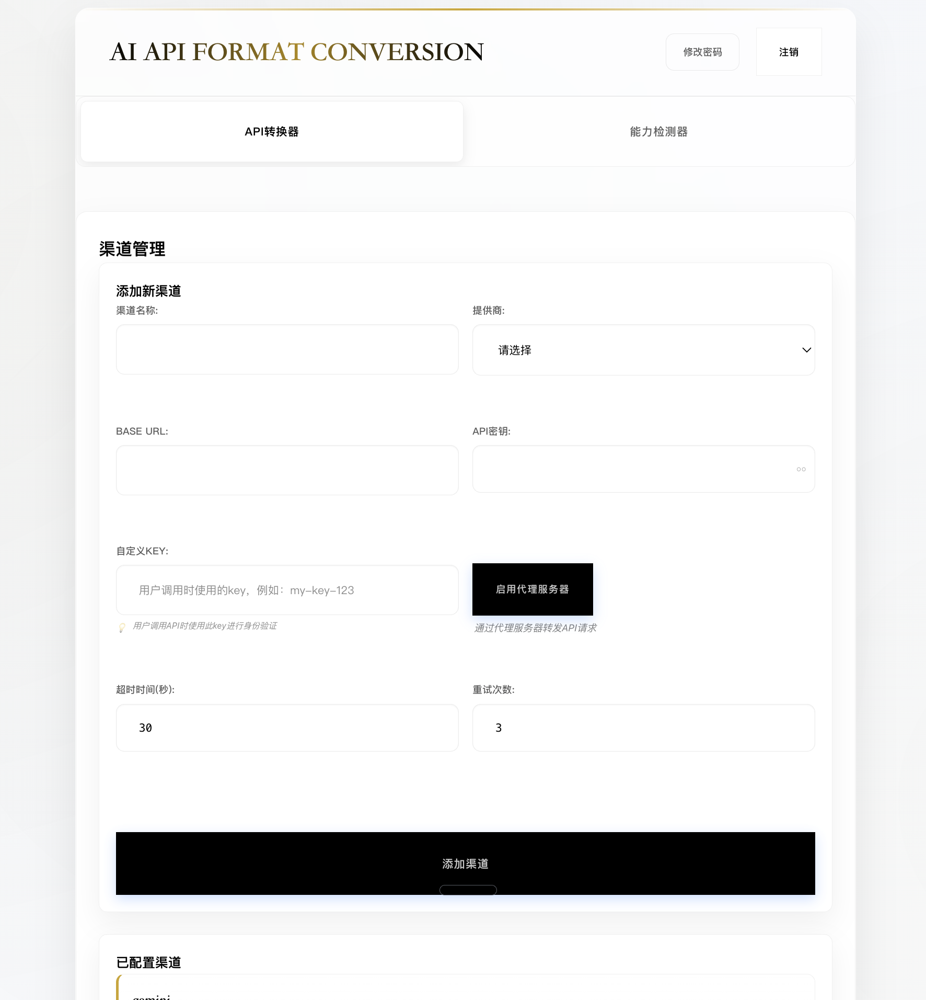
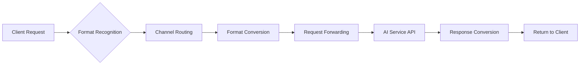

# Multi-Channel AI API Unified Conversion Proxy System | 多渠道AI API统一转换代理系统

<div align="right">
  <details>
    <summary>🌐 Language / 语言</summary>
    <p>
      <a href="README.md">🇨🇳 中文版本</a><br>
      <a href="README_EN.md">🇺🇸 English Version</a>
    </p>
  </details>
</div>

## 📖 Project Overview

This is a multi-channel AI API unified conversion proxy system that supports mutual conversion between OpenAI, Anthropic Claude, and Google Gemini API formats, with multi-channel management and comprehensive capability detection features.



🔄 System Working Principle

### Core Conversion Flow


#### 🎯 1. Format Recognition
- **Auto Detection**: Automatically identify source API format based on request path and parameters
- **Supported Formats**: OpenAI `/v1/chat/completions` | Anthropic `/v1/messages` | Gemini `/v1/models`
- **Smart Parsing**: Parse request headers and parameter structure to determine source format specification

#### 🚀 2. Channel Routing
- **Key Mapping**: Find target channel configuration based on custom API Key
- **Load Balancing**: Support multi-channel polling and weight allocation
- **Failover**: Automatically switch to backup channels to ensure service availability

#### ⚡ 3. Format Conversion
- **Request Conversion**: Convert source format request body to target API format
- **Parameter Mapping**: Automatically handle differences in model names and parameter structures
- **Compatibility Handling**: Maintain integrity of all advanced features

#### 🌐 4. Request Forwarding
- **HTTP Proxy**: Transparently forward to real AI service APIs
- **Authentication Handling**: Automatically inject target channel's API Key and authentication info
- **Timeout Control**: Configurable request timeout and retry mechanisms

#### 🔄 5. Response Conversion
- **Format Unification**: Convert target API response back to source format
- **Streaming Support**: Full support for SSE streaming response format conversion
- **Error Mapping**: Unified error codes and error message formats

## 🎯 Core Features

### 1. Smart Format Conversion
```bash
# Supported conversion paths
OpenAI ↔ Anthropic ↔ Gemini
  ↑         ↑         ↑
  └─────────┼─────────┘
            │
     Any mutual conversion
```

**Supported advanced feature conversions:**
- ✅ **Streaming Response**: Complete conversion of SSE format
- ✅ **Function Calling**: Tool Calling cross-platform mapping
- ✅ **Vision Understanding**: Unified processing of image input formats
- ✅ **Structured Output**: Automatic JSON Schema adaptation
- ✅ **Model Mapping**: Smart model name conversion
- ✅ **Thinking Budget Conversion**: Support OpenAI reasoning_effort ↔ Anthropic/Gemini thinkingBudget interconversion

### 2. Comprehensive Capability Detection
- **Basic Capabilities**: Chat conversation, streaming output, system messages, multi-turn dialogue
- **Advanced Capabilities**: Vision understanding, file upload, structured output, JSON mode
- **Tool Capabilities**: Function calling, tool usage, code execution
- **Model Detection**: Automatically retrieve supported model lists
- **Multi-Platform Support**: OpenAI, Anthropic Claude, Google Gemini

### 3. Multi-Format Model List API 📋
Supports returning model lists in three different formats:

- **OpenAI Format**: `GET /v1/models` (Bearer authentication)
- **Anthropic Format**: `GET /v1/models` (x-api-key authentication)  
- **Gemini Format**: `GET /v1beta/models` (key parameter authentication)

Fetch real model data from APIs with automatic format conversion, no more hardcoded model lists.

## 🚀 Quick Start

1. **Install Dependencies**
```bash
pip install -r requirements.txt
```

2. **Start Web Service**
```bash
python web_server.py
```

3. **Access Web Interface**
- Open browser and visit: http://localhost:3000
- Select AI provider, input API configuration
- One-click detection of all capabilities, view detailed results
- Use conversion functionality, see system working principle for details

## 🔧 .env Configuration

Copy `.env.example` to `.env` and modify configurations as needed:

### Admin Authentication Configuration
- `ADMIN_PASSWORD` - Admin login password (default: admin123), used for Web management interface

### Data Encryption Configuration (Optional)
- `ENCRYPTION_KEY` - API key encryption key, 32-byte Fernet encryption key
- `SESSION_SECRET_KEY` - Session encryption key, 64-character hexadecimal string

### Web Server Configuration (Optional)
- `WEB_PORT` - Web server port (default: 3000)

### AI Service Provider Configuration (Suggest)
- `ANTHROPIC_MAX_TOKENS` - Claude model max token limit (default: 32000)
- `OPENAI_REASONING_MAX_TOKENS` - OpenAI thinking model max_completion_tokens default value (default: 32000)

### Thinking Budget Mapping Configuration (Suggest. If not set, it may cause errors when setting the thinking budget.)
- `OPENAI_LOW_TO_ANTHROPIC_TOKENS` - Anthropic token count for OpenAI low level (default: 2048)
- `OPENAI_MEDIUM_TO_ANTHROPIC_TOKENS` - Anthropic token count for OpenAI medium level (default: 8192)
- `OPENAI_HIGH_TO_ANTHROPIC_TOKENS` - Anthropic token count for OpenAI high level (default: 16384)
- `OPENAI_LOW_TO_GEMINI_TOKENS` - Gemini token count for OpenAI low level (default: 2048)
- `OPENAI_MEDIUM_TO_GEMINI_TOKENS` - Gemini token count for OpenAI medium level (default: 8192)
- `OPENAI_HIGH_TO_GEMINI_TOKENS` - Gemini token count for OpenAI high level (default: 16384)
- `ANTHROPIC_TO_OPENAI_LOW_REASONING_THRESHOLD` - Threshold for judging Anthropic tokens as low (default: 2048)
- `ANTHROPIC_TO_OPENAI_HIGH_REASONING_THRESHOLD` - Threshold for judging Anthropic tokens as high (default: 16384)
- `GEMINI_TO_OPENAI_LOW_REASONING_THRESHOLD` - Threshold for judging Gemini tokens as low (default: 2048)
- `GEMINI_TO_OPENAI_HIGH_REASONING_THRESHOLD` - Threshold for judging Gemini tokens as high (default: 16384)

### Database Configuration (Optional)
- `DATABASE_TYPE` - Database type (sqlite or mysql, default: sqlite)
- `DATABASE_PATH` - SQLite database file path (default: data/channels.db)

#### MySQL Database Configuration (Used when DATABASE_TYPE=mysql)
- `MYSQL_HOST` - MySQL server address
- `MYSQL_PORT` - MySQL port number (default: 3306)
- `MYSQL_USER` - MySQL username
- `MYSQL_PASSWORD` - MySQL password
- `MYSQL_DATABASE` - MySQL database name
- `MYSQL_SOCKET` - MySQL socket file path (optional, used for local connections)

### Logging Configuration (Optional)
- `LOG_LEVEL` - Log level (DEBUG/INFO/WARNING/ERROR/CRITICAL, default: WARNING)
- `LOG_FILE` - Log file path (default: logs/app.log)
- `LOG_MAX_DAYS` - Log file retention days (default: 1 day)

## 🔧 Client Integration Guide

### Using with Claude Code

#### Mac
```bash
export ANTHROPIC_BASE_URL="https://your_url.com"
# Testing found that claude code requires keys to start with sk-
export ANTHROPIC_API_KEY="sk-xxx"
claude --model your_model
```

#### Windows CMD
```cmd
set ANTHROPIC_BASE_URL=https://your_url.com
# Testing found that claude code requires keys to start with sk-
set ANTHROPIC_API_KEY=sk-xxx
claude --model your_model
```

### Using with Gemini-CLI

#### Mac
```bash
export GOOGLE_GEMINI_BASE_URL="https://your_url.com"
export GEMINI_API_KEY="your_api_key"
gemini -m your_model
```

#### Windows CMD
```cmd
set GOOGLE_GEMINI_BASE_URL=https://your_url.com
set GEMINI_API_KEY=your_api_key
gemini -m your_model
```

### Using with Cherry Studio
> Select the provider format you want to convert, fill in the URL, and enter the key for the channel you want to use

## 🚢 Deployment Guide

### Docker Deployment

```bash
# Build image
docker build -t ai-api-detector .

# Run container
docker run -p 8000:8000 ai-api-detector
```

### Local Development

```bash
# Clone project
git clone <repository-url>
cd Api-Conversion

# Install dependencies
pip install -r requirements.txt

# Start development server
python web_server.py --debug
```

### Render Platform Deployment 

The project is pre-configured with `render.yaml` for one-click deployment:

1. **Push code to GitHub**
2. **Connect Render platform**: https://dashboard.render.com
3. **Auto Deploy**: Render will automatically read configuration and deploy

**Configuration Details:**

- **Build Command**: `pip install -r requirements.txt`
- **Start Command**: `python web_server.py --host 0.0.0.0 --port $PORT`
- **Environment Variables**: `PYTHONPATH=/opt/render/project/src`

## 📊 Supported Capability Detection

| Capability | Description | OpenAI | Anthropic | Gemini |
|------------|-------------|--------|-----------|--------|
| Basic Chat | Basic conversation functionality | ✅ | ✅ | ✅ |
| Streaming Output | Real-time streaming response | ✅ | ✅ | ✅ |
| System Messages | System instruction support | ✅ | ✅ | ✅ |
| Function Calling | Tool usage capability | ✅ | ✅ | ✅ |
| Structured Output | JSON format output | ✅ | ✅ | ✅ |
| Vision Understanding | Image analysis capability | ✅ | ✅ | ✅ |
| Thinking Budget | Smart thinking functionality | ✅ | ✅ | ✅ |


## 📄 License

MIT License